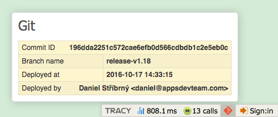

# Tracy Git panel

Useful for displaying information about currently deployed application version.



## Installation

Composer:
```sh
composer require adt/tracy-git
```

config.neon:
```neon
extensions:
	tracyGit: ADT\TracyGit\DI\TracyGitExtension

tracyGit:
	provider: json
	file: %appDir%/git.json
```

Currently supported providers are:

- `json`
  - needs `file` to be specified and existing

## Updating git info

### JSON provider

run `vendor/bin/tracy-git-json app/git.json`

- use `-h` or `--help` to display usage,
- use `--with-user` to include current git user,
- use `--with-timestamp` to include current timestamp

### Auto update

Most deploy systems have list of commands to execute before actual deploy takes place.

Eg. for `dg/ftp-deployment` and JSON provider:

1. ini config
	
		before[] = local: vendor/bin/tracy-git-json app/git.json --with-user
2. php config
	
		$before[] = 'local: vendor/bin/tracy-git-json app/git.json --with-user';
